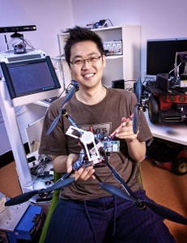

# The master has failed more times than the beginner has ever tried - Master Yoda

<!-- 

 -->

[:material-email:](mailto:enddl22@gmail.com) [:fontawesome-brands-linkedin-in:](https://www.linkedin.com/in/inkyu-sa-16a01257/) [:material-github:](https://github.com/inkyusa) [:fontawesome-brands-kaggle:](https://www.kaggle.com/enddl22) [:newspaper:](https://scholar.google.com.au/citations?user=KxJU37kAAAAJ&hl=en)

My name is Inkyu Sa who is working at CSIRO [Robotics Automation Systems Group](https://research.csiro.au/robotics/)(RASG, Pullenvale, QLD, Australia), Perception team, as senior research scientist. My research interests mostly lay in field robotics :material-robot-mower::material-robot-industrial:, UAV:material-quadcopter: and UGV:fontawesome-solid-tractor: automation, and perception using deep learning techniques.

The page contains some random things that I have done, did, or am doing, hope you can find some information may help your needs.

