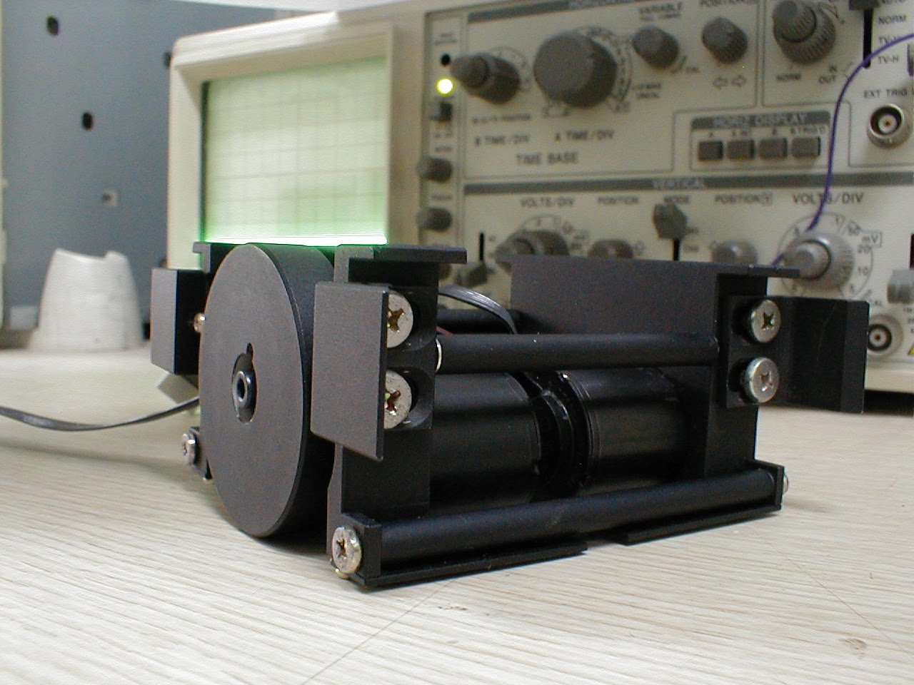

### @SKKU
#### Robot soccer system (2001 - 2004)

<iframe width="600" height="350" src="https://www.youtube.com/embed/ZnXYP1Vbw-Y" title="YouTube video player" frameborder="0" allow="accelerometer; autoplay; clipboard-write; encrypted-media; gyroscope; picture-in-picture" allowfullscreen></iframe>

{ width="200"}
{ width="200"}
{ width="200"}
{ width="200"}
say something

---

### @SAMSUNG
#### The first Samsung's Android phone, I7500 Galaxy in 2009

{ align=left width="200"}

<!-- 

 -->

<!-- Latex test
$$
\operatorname{ker} f=\{g\in G:f(g)=e_{H}\}{\mbox{.}}
$$ -->

### @QUT

### @ETH

### @CSIRO