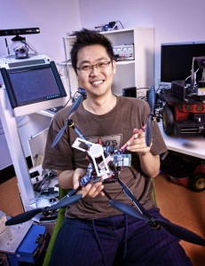

## About me

My name is Inkyu Sa who is working at CSIRO [Robotics Automation Systems Group](https://research.csiro.au/robotics/)(RASG, Pullenvale, QLD, Australia), Perception team, as senior research scientist. My research interests mostly lay in field robotics, UAV and UGV automation, and perception using deep learning techniques. 

The sections below are some random things that I have done, did, or am doing, hope you can find some information may help your needs. In case you can contact me via various means such as enddl2two@gmail.com,[github](https://github.com/inkyusa), [kaggle](https://www.kaggle.com/enddl22), [google scholar](https://scholar.google.com.au/citations?user=KxJU37kAAAAJ&hl=en)

## Acamedic activities
- aa
- bb

## Projects

### @SKKU
- Robot soccer

### @SAMSUNG
- Android phone

### @QUT
- Quad
- Harversting robot
- Fruit detection and picking

### @ETHZ
- Flourish
- AMZ
- Reinforcement Learning

### @CSIRO
- Semantic segmentation

### Others
- 3D mapping
- Kaggle competitions

## Publications

### Journals
1. aa
2. bb
3. cc

### Conferences
1. aa
2. bb
3. cc

### Workshop
1. aa
2. bb
3. cc

## Awards
1. aa
2. bb
3. cc
